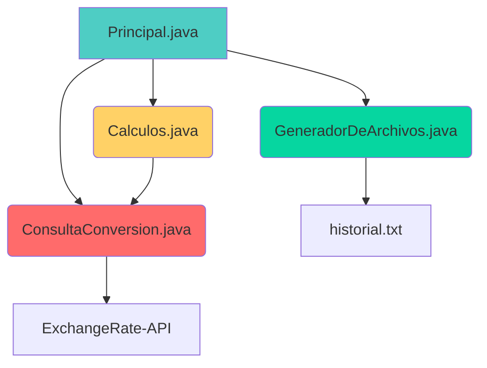

# 💱 Conversor de Monedas - Challenge Alura Latam & Oracle ONE

<div align="center">

**Una aplicación de consola en Java que convierte divisas con tasas en tiempo real y guarda un historial de tus operaciones.**

[](https://www.oracle.com/java/)
[](LICENSE)
[](https://www.oracle.com/ar/education/oracle-next-education/)

[✨ Características](#-características) • [🏗️ Arquitectura](#️-arquitectura) • [🚀 Cómo Empezar](#-cómo-empezar) • [📖 Uso](#-uso) • [👨‍💻 Autor](#-autor)

</div>

---

## 📋 Descripción

Este **Conversor de Monedas** es una aplicación desarrollada en **Java** como respuesta al desafío técnico propuesto por **Alura Latam** en el programa **Oracle Next Education (ONE)**.

La herramienta permite realizar conversiones entre el Dólar Estadounidense (USD) y las principales monedas de Latinoamérica, obteniendo las tasas de cambio más recientes desde una API externa. Además de realizar cálculos precisos, la aplicación registra automáticamente un historial de todas las conversiones, incluyendo fecha y hora, para que puedas llevar un control de tus consultas.

### 🎯 Propósito del Proyecto
- Demostrar la aplicación de **Java** y principios de **Programación Orientada a Objetos** en un caso real.
- Integrar una **API REST** externa para obtener datos en tiempo real.
- Manejar y parsear respuestas en formato **JSON**.
- Gestionar la persistencia básica de datos mediante archivos de texto.
- Crear una **interfaz de consola** clara e interactiva.

---

## ✨ Características

| Característica | Descripción |
| :--- | :--- |
| **🔄 Tasas en Tiempo Real** | Obtiene los últimos tipos de cambio conectándose a **ExchangeRate-API**. |
| **📊 Historial de Conversiones** | Guarda cada operación con su timestamp en un archivo `historial.txt`. |
| **🎯 Enfoque LATAM** | Especializado en conversiones con **Peso Argentino (ARS), Real Brasileño (BRL) y Sol Peruano (PEN)**. |
| **💻 Interfaz Amigable** | Menú de consola intuitivo con validación de entrada de usuario. |
| **🧩 Código Modular** | Organizado en clases con responsabilidades bien definidas para fácil mantenimiento. |

**Pares de Moneda Disponibles:**
1.  Dólar (USD) ⇒ Peso Argentino (ARS)
2.  Peso Argentino (ARS) ⇒ Dólar (USD)
3.  Dólar (USD) ⇒ Real Brasileño (BRL)
4.  Real Brasileño (BRL) ⇒ Dólar (USD)
5.  Dólar (USD) ⇒ Sol Peruano (PEN)
6.  Sol Peruano (PEN) ⇒ Dólar (USD)

---

## 🏗️ Arquitectura

El proyecto sigue una estructura modular que separa la lógica de negocio, el acceso a datos y la interacción con el usuario.



### 📁 Descripción de Clases
| Clase | Responsabilidad |
| :--- | :--- |
| **`Principal.java`** | Punto de entrada. Controla el flujo del programa y la interfaz de consola. |
| **`ConsultaConversion.java`** | Gestiona la comunicación HTTP con la API y parsea la respuesta JSON usando **Gson**. |
| **`Calculos.java`** | Contiene la lógica para realizar los cálculos matemáticos de conversión entre monedas. |
| **`GeneradorDeArchivos.java`** | Se encarga de escribir y guardar el historial de cada conversión en un archivo de texto. |

### 🛠️ Stack Tecnológico
- **Lenguaje:** Java 17
- **Librería JSON:** Gson (de Google) para mapear datos de la API a objetos Java.
- **HTTP Client:** Cliente HTTP estándar de Java para solicitudes a la API.
- **Control de Versiones:** Git / GitHub
- **API Externa:** [ExchangeRate-API](https://www.exchangerate-api.com/) para tasas de cambio.

---

## 🚀 Cómo Empezar

### Prerrequisitos
- **Java Development Kit (JDK) 17** o superior instalado.
- Una **API Key** gratuita de [ExchangeRate-API](https://www.exchangerate-api.com/).
- (Opcional) Un IDE como **IntelliJ IDEA** o **VS Code**.

### Instalación y Configuración
1.  **Clona el repositorio:**
    ```bash
    git clone https://github.com/dovalless/conversordemonedas-master.git
    cd conversordemonedas-master
    ```
2.  **Configura tu API Key:**
    - Abre el archivo `ConsultaConversion.java`.
    - Localiza la variable que contiene la URL de la API (e.g., `"https://v6.exchangerate-api.com/v6/TU_CLAVE/latest/USD"`).
    - Reemplaza `TU_CLAVE` con tu API Key personal.
3.  **Compila y ejecuta:**
    - Puedes compilar desde consola con `javac` o ejecutar directamente la clase `Principal.java` desde tu IDE.

---

## 📖 Uso

Una vez ejecutado, la aplicación guiará al usuario a través de un menú en consola.

**Ejemplo de Flujo:**
```text
****************************************
Bienvenido al Conversor de Monedas =)
****************************************

1) Dólar (USD) =>> Peso Argentino (ARS)
2) Peso Argentino (ARS) =>> Dólar (USD)
3) Dólar (USD) =>> Real Brasileño (BRL)
... (Otras opciones)
7) Salir

Elige una opción válida: 1
Ingrese el monto que deseas convertir: 20
El valor: 20.0 [USD] corresponde al valor final de: 19995.0 [ARS]
****************************************
```

**Historial Generado:**
Cada conversión se guarda automáticamente en `historial.txt` con un formato similar a:
```
[23-01-2026 10:30] 20.0 USD => 19995.0 ARS
```

---

## 👨‍💻 Autor

**Darwin Manuel Ovalles Cesar**

*Proyecto desarrollado para completar el Challenge de Conversión del programa **Oracle Next Education (ONE)** en colaboración con **Alura Latam**.*

[](https://www.linkedin.com/in/darwin-manuel-ovalles-cesar-dev/)
[](https://github.com/dovalless)

---

## 📄 Licencia

Este proyecto está distribuido bajo la Licencia MIT. Consulta el archivo `LICENSE` para más información.

---
<div align="center">
¡Gracias por visitar este proyecto! Las contribuciones y sugerencias son siempre bienvenidas.
</div>
